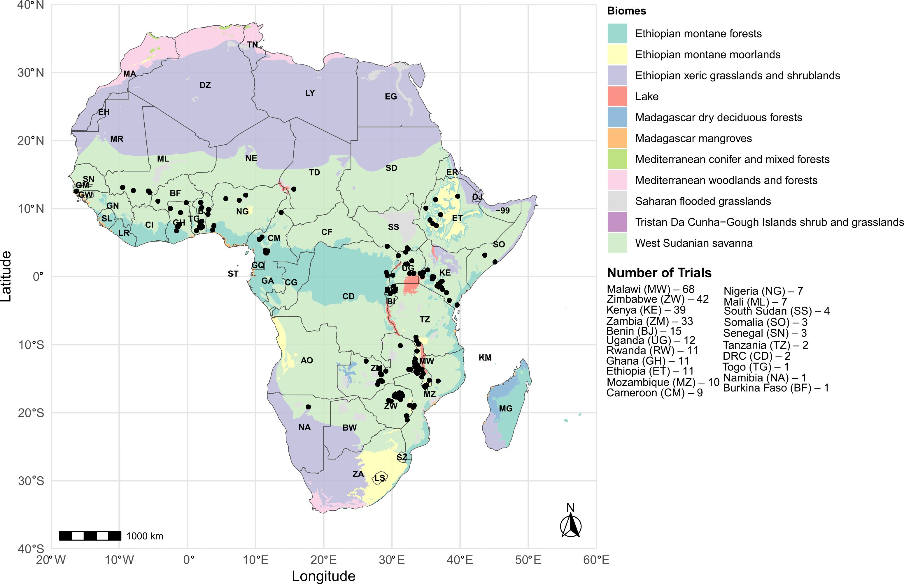

# Pan_African_Trials_Network 🌍🌱  
**High-resolution soybean trial data supporting the expansion of agriculture in Africa**

 
 
 
 

---

## 👩‍🔬 Authors

Mauricio S. Araújo¹\*, Saulo F.S. Chaves², Gerson N.C. Ferreira¹, Godfree Chigeza³, Brian W. Diers⁴, Erica P. Leles⁴, Michelle F. Santos⁴, Peter Goldsmith⁴, José B. Pinheiro¹\*  

¹ Department of Genetics, University of São Paulo, Genetics Diversity and Breeding Laboratory, Piracicaba - SP, Brazil  
² Department of Genetics, University of São Paulo, Genomics, Analytics and Breeding Laboratory, Piracicaba - SP, Brazil  
³ Feed the Future Innovation Lab, University of Illinois Urbana-Champaign, United States Agency for International Development (USAID), Washington, DC, United States  
⁴ Department of Crop Sciences, University of Illinois at Urbana-Champaign, Urbana, 61801, USA  

📧 *mauricioaraujj@usp.br and jbaldin@usp.br*

---

## 🧭 Project Overview

This repository contains a comprehensive dataset and full analysis pipeline for understanding soybean cultivar responses to diverse African agroecologies using multi-environment trials (METs) from 2015 to 2024/25.

**Key features:**
- 292 trials across 138 locations in 21 countries
- 366 soybean varieties
- Agronomic + nutritional + environmental (soil, weather, management) data
- Includes environmental covariates for enviromics
- Facilitates genotype × environment × management (G×E×M) modeling and recommendation

---

## 🗺️ Graphical Overview

The figure below summarizes the core pipeline, from trials to prediction and recommendation:

---

## 📂 Repository Structure

| Folder/File       | Description |
|-------------------|-------------|
| [`/data`](./data) | Environmental covariates, trial data, coordinates, etc. |
| [`/figures`](./figures) | All plots (H², yield boxplots, FA results, maps, sPLS, etc.) |
| [`/metadata`](./metadata) | Related scientific publications derived from this dataset |
| [`/output`](./output) | Outputs from statistical models and analyses (e.g., `.RData`, `.csv`) |
| [`/scripts`](./scripts) | R scripts for each step of the analysis pipeline |
| `Pan_African_Trials_Network.Rproj` | RStudio project file |
| `README.md` | This description page |
| `LICENSE` | License for this repository |

---

## 🧬 Scripts

> **Directory:** [`/scripts`](./scripts)

Includes R scripts to run and reproduce the analysis:
- `Fa_Model.R`, `PLS.R` – Modeling
- `Outliers.R`, `Residual.R`, `LRT.R` – Diagnostics
- `Map.R`, `boxplot.R`, `country_conn.R` – Visualization
- `weather.R`, `worldclim.R`, `SoilData.R` – Envirotyping tools

---

## 📊 Data Summary

> **Directory:** [`/data`](./data)

- `Malawi_data.csv`: Trial data from Malawi  
- `Covamb.csv`, `Weather.csv`, `Soil.csv`, `Elevation.csv`: Environmental variables  
- `bioclimatic.csv`: WorldClim bioclimatic data  
- `coords.txt`: Geographic coordinates  
- `data.csv`: Full cleaned dataset used in the models

---

## 📚 Previous Publications

> **Directory:** [`/metadata`](./metadata)

Below are scientific publications **originated from the Pan-African soybean trials dataset**:

- [📄 Optimizing soybean variety selection for the Pan African Trial network using G×E models](https://doi.org/10.3389/fpls.2025.1594736)  
  *Frontiers in Plant Science (2025)*

- [📄 Implementation of a GAM for Soybean Maturity modeling](https://doi.org/10.1002/ps.8639)  
  *Pest Management Science (2025)*

- [📄 Evaluating genetic diversity and seed composition stability within Pan-African trials](https://doi.org/10.1002/csc2.21356)  
  *Crop Science (2023)*

- [📄 Soybean rust resistant and tolerant varieties identified through the Pan African trials](https://doi.org/10.3390/agronomy11061043)  
  *Agronomy (2021)*

---

## 📘 Citation

> Araújo, M.S., Chaves, S.F.S., Ferreira, G.N.C., Chigeza, G., Diers, B.W., Leles, E.P., Santos, M.F., Goldsmith, P., Pinheiro, J.B.  
> **High-resolution soybean trial data supporting the expansion of agriculture in Africa** (2025)

---

## 📬 Contact

Have questions, want to collaborate, or found a bug?  
Feel free to contact:

📧 *mauricioaraujj@usp.br*  
📧 *jbaldin@usp.br*
